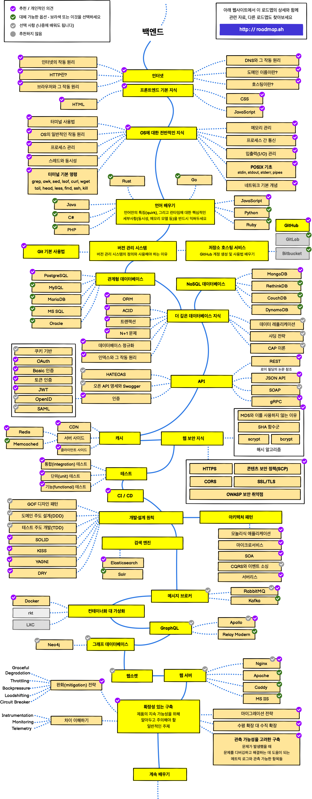

# 백엔드 로드맵 정리

###### 이 프로젝트는 <b>jonghyuck’s velog</b>님의 velog 페이지를 기반으로 만들어졌습니다.



## 사용방법

```sh
$ git clone https://github.com/rlaxogh5079/backend-roadmap
$ python3 -m mkdocs serve
```

위 명령어를 입력한 후, localhost:8000에 접속후 사용
